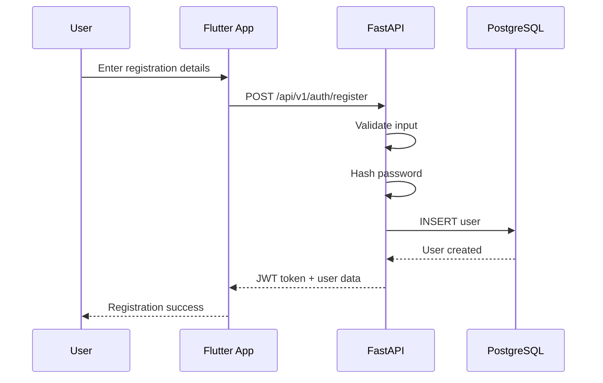
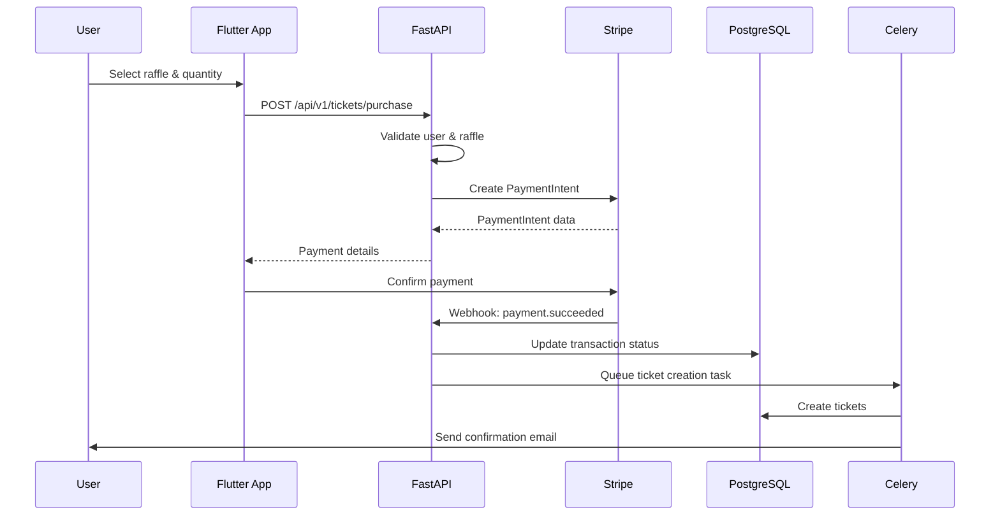
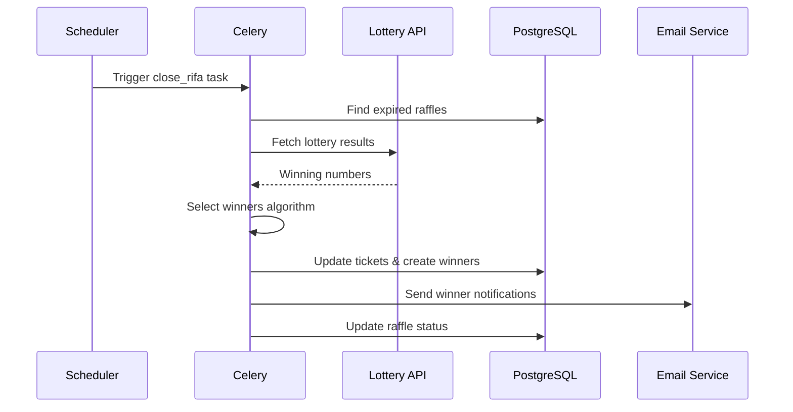

# Rifa1122 System Architecture

## Overview

Rifa1122 is a comprehensive lottery and raffle management system designed for the Colombian market. The system enables users to participate in raffles where winners are determined by official lottery results, providing a transparent and regulated gaming experience.

## System Architecture

### High-Level Architecture

```
┌─────────────────────────────────────────────────────────────────┐
│                        CLIENT LAYER                             │
├─────────────────────────────────────────────────────────────────┤
│  ┌─────────────────┐  ┌─────────────────┐  ┌─────────────────┐  │
│  │   Flutter Web   │  │  Flutter iOS    │  │  Flutter Android │  │
│  │                 │  │                 │  │                  │  │
│  │ - SPA Interface │  │ - Native iOS    │  │ - Native Android  │  │
│  │ - PWA Support   │  │ - App Store     │  │ - Play Store      │  │
│  └─────────────────┘  └─────────────────┘  └─────────────────┘  │
└─────────────────────────────────────────────────────────────────┘
                                   │
                                   ▼
┌─────────────────────────────────────────────────────────────────┐
│                       API GATEWAY LAYER                         │
├─────────────────────────────────────────────────────────────────┤
│  ┌─────────────────┐  ┌─────────────────┐  ┌─────────────────┐  │
│  │   Nginx Load    │  │   Rate Limiting │  │  SSL/TLS        │  │
│  │   Balancer      │  │                 │  │  Termination     │  │
│  │                 │  │ - 10 req/min    │  │                  │  │
│  │ - Sticky Sessions│  │ - DDoS Protection│  │ - Let's Encrypt │  │
│  └─────────────────┘  └─────────────────┘  └─────────────────┘  │
└─────────────────────────────────────────────────────────────────┘
                                   │
                                   ▼
┌─────────────────────────────────────────────────────────────────┐
│                      APPLICATION LAYER                          │
├─────────────────────────────────────────────────────────────────┤
│  ┌─────────────────┐  ┌─────────────────┐  ┌─────────────────┐  │
│  │   FastAPI App   │  │   Background    │  │   Webhook        │  │
│  │                 │  │   Workers       │  │   Handler        │  │
│  │ - REST API      │  │ - Celery        │  │ - Stripe         │  │
│  │ - JWT Auth      │  │ - Winner Select │  │ - Payment Events │  │
│  │ - OpenAPI Docs  │  │ - Payouts       │  │                  │  │
│  └─────────────────┘  └─────────────────┘  └─────────────────┘  │
└─────────────────────────────────────────────────────────────────┘
                                   │
                                   ▼
┌─────────────────────────────────────────────────────────────────┐
│                       DATA LAYER                                │
├─────────────────────────────────────────────────────────────────┤
│  ┌─────────────────┐  ┌─────────────────┐  ┌─────────────────┐  │
│  │  PostgreSQL     │  │     Redis       │  │   External APIs  │  │
│  │                 │  │                 │  │                  │  │
│  │ - User Data     │  │ - Cache         │  │ - Lottery Results│  │
│  │ - Transactions  │  │ - Sessions      │  │ - Stripe         │  │
│  │ - Raffle Data   │  │ - Message Queue │  │ - Email Service  │  │
│  └─────────────────┘  └─────────────────┘  └─────────────────┘  │
└─────────────────────────────────────────────────────────────────┘
```

## Component Details

### 1. Client Layer (Flutter)

#### Architecture Pattern: Clean Architecture + MVVM

```
lib/
├── core/                    # Core business logic
│   ├── network/            # API clients & interceptors
│   ├── theme/              # UI themes & styles
│   ├── utils/              # Helper functions
│   └── constants/          # App constants
├── features/               # Feature modules
│   ├── auth/               # Authentication
│   │   ├── data/           # Repositories & data sources
│   │   ├── domain/         # Use cases & entities
│   │   ├── presentation/   # UI & state management
│   │   └── models/         # Data models
│   ├── rifas/              # Raffles feature
│   └── tickets/            # Tickets feature
├── shared/                 # Shared components
│   ├── widgets/            # Reusable UI components
│   └── providers/          # Global state providers
└── main.dart              # App entry point
```

#### State Management: Riverpod

- **Provider Scope**: Global state container
- **StateNotifierProvider**: Complex state management
- **FutureProvider**: Async operations
- **StreamProvider**: Real-time data

#### Key Features:
- **Cross-platform**: iOS, Android, Web
- **Offline-first**: Local data persistence
- **PWA Support**: Installable web app
- **Responsive Design**: Mobile-first approach

### 2. Application Layer (FastAPI)

#### Architecture Pattern: Clean Architecture

```
backend/app/
├── api/                    # API layer
│   └── v1/
│       ├── endpoints/      # Route handlers
│       ├── deps.py         # Dependencies
│       └── api.py          # Router configuration
├── core/                   # Core functionality
│   ├── config.py           # Settings & configuration
│   ├── security.py         # Auth & encryption
│   ├── logging.py          # Structured logging
│   ├── rate_limiting.py    # Rate limiting
│   └── celery_app.py       # Background tasks
├── models/                 # Database models (SQLAlchemy)
├── schemas/                # API schemas (Pydantic)
├── services/               # Business logic services
├── repositories/           # Data access layer
├── db/                     # Database setup & session
└── main.py                 # Application entry point
```

#### Key Components:

**API Endpoints:**
- Authentication (`/auth`)
- Raffles management (`/rifas`)
- Tickets purchasing (`/tickets`)
- User profiles (`/users`)
- Webhooks (`/webhooks`)

**Background Tasks (Celery):**
- Raffle winner selection
- Payment processing
- Notification sending
- Lottery result reconciliation

### 3. Data Layer

#### PostgreSQL Database Schema

```sql
-- Core Entities
users (id, nombre, email, telefono, rol, hashed_password, creado_en)
loterias (id, nombre, descripcion, frecuencia, url_resultados)
categoria_rifas (id, nombre, color, valor_boleta, rake, fondo_premios, premio_por_ganador)
rifas (id, nombre, categoria_id, loteria_id, fecha_inicio, fecha_fin, estado, total_boletas)
tickets (id, rifa_id, usuario_id, numero, comprado_en, estado)
ganadores (id, ticket_id, monto_ganado, fecha_pago)
transacciones (id, user_id, amount, currency, provider, status, created_at)

-- Relationships
rifas.categoria_id → categoria_rifas.id
rifas.loteria_id → loterias.id
tickets.rifa_id → rifas.id
tickets.usuario_id → users.id
ganadores.ticket_id → tickets.id
transacciones.user_id → users.id
```

#### Redis Usage

- **Cache**: API responses, user sessions, raffle data
- **Message Queue**: Celery task queue
- **Rate Limiting**: Request throttling data
- **Session Store**: User session data

#### Data Flow Patterns

**Read Operations:**
```
Client → API → Repository → Database → Repository → Service → API → Client
```

**Write Operations:**
```
Client → API → Service → Repository → Database
                      ↓
                Background Task → External API
```

## Security Architecture

### Authentication & Authorization

```
┌─────────────┐    ┌─────────────┐    ┌─────────────┐
│   Client    │───►│   JWT Token │───►│  User Roles │
│             │    │             │    │             │
│ - Login     │    │ - Issued    │    │ - jugador   │
│ - Register  │    │ - Verified  │    │ - operador  │
│             │    │ - Expires   │    │ - admin     │
└─────────────┘    └─────────────┘    └─────────────┘
```

#### JWT Token Structure
```json
{
  "sub": "user@example.com",
  "user_id": "550e8400-e29b-41d4-a716-446655440000",
  "rol": "jugador",
  "exp": 1638360000,
  "iat": 1638273600
}
```

### Security Measures

- **Password Hashing**: bcrypt with salt
- **Rate Limiting**: 10 requests per minute per user
- **CORS**: Configured for allowed origins
- **Input Validation**: Pydantic models
- **SQL Injection Prevention**: SQLAlchemy ORM
- **HTTPS**: SSL/TLS encryption
- **Security Headers**: XSS protection, CSRF, etc.

## Payment Processing

### Stripe Integration

```
┌─────────────┐    ┌─────────────┐    ┌─────────────┐
│   Client    │───►│   Payment   │───►│   Stripe    │
│             │    │   Intent    │    │   API       │
│ - Purchase  │    │   Created   │    │             │
│ - Confirm   │    │   Confirmed │    │ - Charge    │
└─────────────┘    └─────────────┘    │ - Webhook   │
                                      └─────────────┘
                                               │
                                               ▼
                                    ┌─────────────┐
                                    │  Webhook    │
                                    │  Handler    │
                                    │             │
                                    │ - Update    │
                                    │   Status    │
                                    │ - Send      │
                                    │   Receipt   │
                                    └─────────────┘
```

### Payment Flow

1. **Client** initiates purchase
2. **API** creates Stripe PaymentIntent
3. **Client** confirms payment with Stripe
4. **Stripe** sends webhook to API
5. **API** updates transaction status
6. **Background task** processes tickets

## Background Processing

### Celery Task Architecture

```
┌─────────────┐    ┌─────────────┐    ┌─────────────┐
│   API Call  │───►│   Task      │───►│   Worker    │
│             │    │   Queued    │    │   Process   │
│ - Close     │    │             │    │             │
│   Raffle    │    │ - close_rifa│    │ - Select    │
│             │    │ - process_  │    │   Winner    │
│ - Purchase  │    │   payout    │    │ - Send      │
│             │    │             │    │   Payment   │
└─────────────┘    └─────────────┘    └─────────────┘
```

### Key Background Tasks

- **close_rifa**: Closes expired raffles and selects winners
- **process_payout**: Handles winner payments via Stripe
- **reconcile_loteria**: Syncs with lottery result APIs
- **send_notifications**: Sends push notifications and emails

## External Integrations

### Lottery Result APIs

```
┌─────────────┐    ┌─────────────┐    ┌─────────────┐
│   System    │───►│   Lottery   │───►│   Official  │
│             │    │   API       │    │   Results   │
│ - Scheduled │    │   Client    │    │             │
│   Task      │    │             │    │ - Baloto    │
│             │    │ - Fetch     │    │ - Chance    │
│ - Winner    │    │   Results   │    │ - Others    │
│   Selection │    │             │    │             │
└─────────────┘    └─────────────┘    └─────────────┘
```

### Colombian Lottery Integration

- **Baloto**: National lottery (Mondays, Thursdays)
- **Chances**: Daily lottery games
- **Lotería de Bogotá**: Regional lottery
- **Other regional lotteries**: Valle, Meta, Cauca, etc.

## Monitoring & Observability

### Application Metrics

```
┌─────────────┐    ┌─────────────┐    ┌─────────────┐
│   FastAPI   │───►│ Prometheus  │───►│ Grafana     │
│   App       │    │   Metrics   │    │ Dashboard   │
│             │    │             │    │             │
│ - Request   │    │ - Response  │    │ - API       │
│   Count     │    │   Time      │    │   Latency   │
│ - Error     │    │ - Error     │    │ - Error     │
│   Rate      │    │   Rate      │    │   Rate      │
└─────────────┘    └─────────────┘    └─────────────┘
```

### Logging Architecture

- **Structured Logging**: JSON format with context
- **Log Levels**: DEBUG, INFO, WARNING, ERROR, CRITICAL
- **Log Aggregation**: Centralized logging system
- **Audit Logs**: Security and compliance events

### Health Checks

- **Application Health**: `/api/v1/health`
- **Database Connectivity**: Connection pool status
- **External Services**: Stripe, Redis connectivity
- **Background Workers**: Celery task status

## Deployment Architecture

### Containerized Deployment

```
┌─────────────────────────────────────────────────────────────┐
│                    Docker Compose Stack                      │
├─────────────────────────────────────────────────────────────┤
│  ┌─────────────┐  ┌─────────────┐  ┌─────────────┐          │
│  │  PostgreSQL │  │    Redis    │  │   FastAPI   │          │
│  │             │  │             │  │   App       │          │
│  │ - Data      │  │ - Cache     │  │             │          │
│  │   Volume    │  │ - Queue     │  │ - Gunicorn  │          │
│  └─────────────┘  └─────────────┘  │ - Workers   │          │
│                                    └─────────────┘          │
│  ┌─────────────┐  ┌─────────────┐                           │
│  │   Celery    │  │   Nginx     │                           │
│  │   Workers   │  │             │                           │
│  │             │  │ - Load      │                           │
│  │ - Tasks     │  │   Balance   │                           │
│  └─────────────┘  │ - SSL       │                           │
│                   └─────────────┘                           │
└─────────────────────────────────────────────────────────────┘
```

### Production Considerations

- **Load Balancing**: Nginx for API distribution
- **Auto Scaling**: Based on CPU/memory metrics
- **Database Replication**: Read replicas for performance
- **CDN**: Static asset delivery
- **Backup Strategy**: Automated database backups
- **Disaster Recovery**: Multi-region deployment

## Performance Characteristics

### Response Times

- **API Endpoints**: < 200ms average
- **Database Queries**: < 50ms average
- **Payment Processing**: < 5 seconds
- **Background Tasks**: < 30 seconds

### Scalability Metrics

- **Concurrent Users**: 10,000+
- **Requests per Second**: 1,000+
- **Database Connections**: 100+ pool
- **Cache Hit Rate**: > 90%

### Resource Requirements

- **CPU**: 2-4 cores per API instance
- **Memory**: 2-4 GB per API instance
- **Storage**: 50-100 GB database
- **Network**: 100 Mbps minimum

## Data Flow Diagrams

### User Registration Flow



### Ticket Purchase Flow



### Winner Selection Flow



## Compliance & Regulations

### Colombian Gaming Regulations

- **Coljuegos Oversight**: National gaming regulator
- **Age Restrictions**: 18+ for participation
- **Responsible Gaming**: Self-exclusion options
- **Financial Reporting**: Transaction logging and reporting
- **Anti-Money Laundering**: KYC and transaction monitoring

### Data Protection

- **GDPR Compliance**: User data protection
- **Data Encryption**: At rest and in transit
- **Audit Trails**: All user actions logged
- **Data Retention**: Configurable retention policies

This architecture document provides a comprehensive overview of the Rifa1122 system, covering all major components, data flows, and design decisions. The system is designed for scalability, security, and compliance with Colombian gaming regulations.